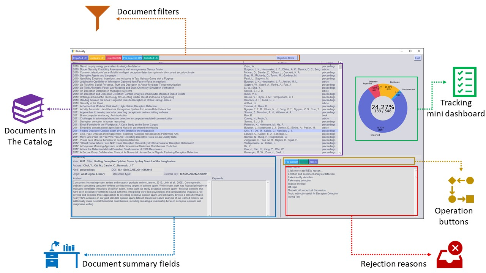

# BiblioAlly Browser

The **BiblioAlly Browser** offers a visual way to operate on the Catalog and track what was
already done and what is still to be done during the various phases of the Literature Review [workflow](workflow.md).

Anatomy of the **BiblioAlly** Browser.

The Browser is no more than a single window and two pop-up dialogs. In the main window the user will find most of the visual
features currently offered:

1. **Documents in the Catalog**: is a grid-like widget that lists all the documents existing in the Catalog and visible
according to the active filters;
2. **Documents filters**: are buttons that will hide and show documents according to their conditions; the colored buttons
on the left activate and deactivate a filter based on general states of a document; besides that, the single
button on the right allows filtering by the rejection reason set in a document;
3. **Rejection reasons**: are a list of all reasons documents were rejected; new reasons can be added as they are
detected and when a document does not meet the selection criteria, it will be rejected by one of those reasons;
4. **Document summary fields**: shows all the fields that characterize the selected document, including the abstract
and keywords that are useful during the shallow screening phase;
5. **Operation buttons**: let the user decide what to do with the selected document;
6. **Tracking mini dashboard**: shows a tracking data that useful to evaluate how much work is already done
   (the amount of documents not tagged as IMPORTED) and how much is still to be done (the amount of document
   still tagged as IMPORTED), allowing to calculate an estimate of the time needed to finnish the process.

Besides the main window, the Browser shows a pop-up dialog to let the user add a new rejection
reason and another is showed to allow the user choosing the reasons to filter the documents.

The Browser is invoked by some simple [lines of Python code](use_case-invoking_browser.md).

